# 会社のNotionからZennへの記事公開を自動化する仕組み


Zennでは、自身のGitHubリポジトリと記事を連携させてコンテンツを管理できます。詳細な設定方法は公式ガイドに記載されていますが、個々人が会社の記事を管理すると、レビューや品質が不十分になる可能性があります。会社で作成した技術記事は会社の資産と見なされるべきであり、その品質を確保するために、会社でのレビュー体制を設けることが重要だと考えています。


このような体制を整えるために、NotionからGitHubを通じてZennへ記事を自動で公開する仕組みを構築しました。


## 流れ

1. **会社のNotionに記事を投稿する**

	まず、会社のNotionスペースに記事を投稿します。

2. **レビューを依頼する**

	投稿後、チームメンバーに簡易レビューを依頼します。レビューが完了したら、記事の`Status`を`公開`に設定します。

3. **GitHub Actionsが定期的に実行される**

	記事が公開状態になると、GitHub Actions（GHA）が定期的に実行されます。GHAはNotionの記事をMarkdown形式でGitHubリポジトリに保存します。


	例: `https://github.com/exxinc/pubtech-techblog/blob/main/articles/yoshiki-0428/test________.md`

4. **個人GitHubリポジトリにPRが作成される**

	GHAが実行されると、個人のGitHubリポジトリにプルリクエスト（PR）が自動的に作成されます。


	例: `https://github.com/yoshiki-0428/zenn_repos/pull/3`

5. **PRをマージする**

	PRを自分で確認し、問題がなければマージします


	

6. **Zennで記事が公開される**

	Zennとの連携が設定されていると、マージ後にZenn上で記事が公開されます。


	
@[card](https://zenn.dev/zenn/articles/connect-to-github)

```mermaid
graph LR
    N[会社Notion] --> R[会社Repo]
    R --> G[GitHub Actions]
    G --> PR[PR作成]
    PR --> M[自身のRepo]

```
	





### 作成したGHA


会社用のRepositoryで記事をmarkdownで管理しています。`articles/[username]`のようにして保存しています。 後々会社用のTech Blogを立ち上げたいとなっても対応できるように保存しています。


基本的に公開してからでないとコミットされないのでnotionの運用を気をつければ、大丈夫なはずです。


```yaml
name: Publish Notion Articles to Multiple Repos

on:
  push:
    branches:
      - main
  workflow_dispatch: {}  # 手動実行も可能
  schedule:
    - cron: '0 0 * * *'

jobs:
  generate-articles:
    runs-on: ubuntu-latest
    steps:
      - name: Checkout Repository
        uses: actions/checkout@v4.2.2

      - name: Setup Bun
        uses: oven-sh/setup-bun@v1

      - name: Install Dependencies
        run: bun install

      - name: Run Notion to Markdown Script
        env:
          PERSONAL_NOTION_TOKEN: ${{ secrets.PERSONAL_NOTION_TOKEN }}
          PERSONAL_NOTION_DATABASE_ID: ${{ secrets.PERSONAL_NOTION_DATABASE_ID }}
          CLOUDINARY_CLOUD_NAME: ${{ secrets.CLOUDINARY_CLOUD_NAME }}
          CLOUDINARY_API_KEY: ${{ secrets.CLOUDINARY_API_KEY }}
          CLOUDINARY_API_SECRET: ${{ secrets.CLOUDINARY_API_SECRET }}
        run: bun run scripts/index.ts

      - name: Commit and Push Changes
        run: |
          git config --local user.email "zenn-bot@github.com"
          git config --local user.name "zenn-bot"
          git add .
          if ! git diff --cached --quiet; then
            git commit -m "Update articles from Notion"
            git push
          else
            echo "No changes to commit."
          fi

  create-prs:
    needs: generate-articles
    runs-on: ubuntu-latest
    strategy:
      matrix:
        repo:
          - { owner: 'yoshiki-0428', name: 'zenn_repos', token: 'GH_REPO_TOKEN_YOSHIKI' }
          # 必要な数だけ追加
          # - { owner: 'owner2', name: 'repo2', token: 'TARGET_REPO2_TOKEN' }
    steps:
      - name: Checkout Repository
        uses: actions/checkout@v4.2.2
        with:
          ref: ${{ github.ref }}

      - name: Checkout Target Repository
        uses: actions/checkout@v4.2.2
        with:
          repository: ${{ matrix.repo.owner }}/${{ matrix.repo.name }}
          token: ${{ secrets[matrix.repo.token] }}
          path: target-repo

      - name: Copy Articles into Target Repo
        run: |
          cp -r articles/${{ matrix.repo.owner }}/* target-repo/articles/
        working-directory: ${{ github.workspace }}

      - name: Create Pull Request
        uses: peter-evans/create-pull-request@v7
        with:
          token: ${{ secrets[matrix.repo.token] }}
          commit-message: "Update articles from Pubtech Notion"
          branch: notion-update-${{ github.run_number }}
          title: "Update Articles from Notion"
          body: "Automatically generated PR with updated articles."
          base: main
          path: "target-repo/"
          add-paths: "*.md"

```


### notionの内容をmarkdownに変換する処理


今回はnodeの`notion-to-md` と`@notionhq/client` を使用しています。

- 行っていることはnotionに必要項目が揃っているか

```typescript
          {
            property: 'Status',
            status: { equals: '公開' }
          },
          {
            property: 'User Name',
            select: { is_not_empty: true }
          },
          {
            property: 'ZennType',
            select: { is_not_empty: true }
          },
          {
            property: 'Tags',
            multi_select: { is_not_empty: true }
          },
          {
            property: 'Slug',
            rich_text: { is_not_empty: true }
          }
```

- 揃っていれば、pageをクエリして
- Zenn用にあったfrontMatterを作成して

```typescript
      const frontMatter = `---
title: ${title}
emoji: ${page.icon?.emoji ?? '📝'}
type: ${zennType}
topics: [${page.properties.Tags.multi_select.map((tag: any) => tag.name).join(', ')}]
published: true
publication_name: "pubtech"
---

`;
```

- zenn用のmarkdownに変換する

:::message
toggleの場合は、notion-to-mdが対応していないらしく、正規表現で対応しました
:::


```typescript
      const content = frontMatter + mdString.parent
        // callout 💡の場合、メッセージ
        .replace(/:::message
(.+)/g, (match, p1) => {
:::
          return `:::message\n${p1}\n:::`; })
        // callout ⚠️の場合、警告メッセージ
        .replace(/:::message alert
(.+)/g, (match, p1) => {
:::
          return `:::message alert\n${p1}\n:::`; })
        // toggle の場合、details に変換
        .replace(/<details>\n<summary>(.*?)<\/summary>(.*?)<\/details>/gs, (match, summary, content) => {
        return `:::details ${summary}
${content}
:::`;
      });
```


@[card](https://github.com/souvikinator/notion-to-md/issues/98)


:::details コードが長いので全部はこちらに


```typescript
(async () => {
  try {
    // 例：Status プロパティが "公開" かつ、ZennTypeが設定されている記事を取得
    const response = await notion.databases.query({
      database_id: databaseId,
      filter: {
        and: [
          {
            property: 'Status',
            status: { equals: '公開' }
          },
          {
            property: 'User Name',
            select: { is_not_empty: true }
          },
          {
            property: 'ZennType',
            select: { is_not_empty: true }
          },
          {
            property: 'Tags',
            multi_select: { is_not_empty: true }
          },
          {
            property: 'Slug',
            rich_text: { is_not_empty: true }
          }
        ]
      },
    });
    const pages = response.results as any[];

    console.log('published articles:', pages.length);

    // Notionから生成されたslugの一覧を保持する配列
    const generatedSlugs = new Set<string>();

    for (const page of pages) {
      const pageId: string = page.id;

      // タイトル取得
      const title: string = page.properties["名前"].title[0].plain_text;

      // User Name を取得
      const userName: string = page.properties["User Name"].select.name;

      // ファイル名用の Raw Slug（なければ pageId をベースにする）
      const slugProp = page.properties.Slug;
      const rawSlug: string =
          (slugProp && slugProp.rich_text?.[0]?.plain_text.replace(/\s+/g, '-')) ||
          pageId.replace(/-/g, '');
      // ルールに則ってslugをクリーンにする
      const slug = cleanSlug(rawSlug);
      generatedSlugs.add(slug);

      // notion-to-md でページ内容を Markdown に変換
      const mdBlocks = await n2m.pageToMarkdown(pageId);
      const mdString = n2m.toMarkdownString(mdBlocks);

      // zenn type の取得
      const zennType = page.properties.ZennType.select.name;

      // Zenn 用 Front Matter の生成
      const frontMatter = `---
title: ${title}
emoji: ${page.icon?.emoji ?? '📝'}
type: ${zennType}
topics: [${page.properties.Tags.multi_select.map((tag: any) => tag.name).join(', ')}]
published: true
publication_name: "pubtech"
---

`;
      if (!mdString.parent) {
        console.error(`Error: ${title} has no content.`);
        continue;
      }
      // zenn用のmarkdownに変換
      const content = frontMatter + mdString.parent
        // callout 💡の場合、メッセージ
        .replace(/:::message
(.+)/g, (match, p1) => {
:::
          return `:::message\n${p1}\n:::`; })
        // callout ⚠️の場合、警告メッセージ
        .replace(/:::message alert
(.+)/g, (match, p1) => {
:::
          return `:::message alert\n${p1}\n:::`; })
        // toggle の場合、details に変換
        .replace(/<details>\n<summary>(.*?)<\/summary>(.*?)<\/details>/gs, (match, summary, content) => {
        return `:::details ${summary}
${content}
:::`;
      });

      // ※ mdString.parent を使用しているのは、notion-to-md の出力構造に合わせています。
      // const content = frontMatter + mdString.parent;

      // User Name ごとのディレクトリ作成
      const userDir = path.join('articles', userName);
      if (!fs.existsSync(userDir)) {
        fs.mkdirSync(userDir, { recursive: true });
      }

      // ファイルの出力
      const filePath = path.join(userDir, `${slug}.md`);
      fs.writeFileSync(filePath, content, 'utf8');
      console.log(`File created: ${filePath}`);
    }

    // 既存のarticlesディレクトリ内の.mdファイルを走査し、
    // 生成されたslugに含まれていないファイルを削除する
    const files = fs.readdirSync('articles');
    for (const file of files) {
      const userDirPath = path.join('articles', file);
      const stats = fs.statSync(userDirPath);
      if (stats.isDirectory()) {
        const userFiles = fs.readdirSync(userDirPath);
        for (const userFile of userFiles) {
          const baseName = path.basename(userFile, '.md');
          if (!generatedSlugs.has(baseName)) {
            const filePath = path.join(userDirPath, userFile);
            fs.unlinkSync(filePath);
            console.log(`Deleted obsolete file: ${filePath}`);
          }
        }
      }
    }
  } catch (error) {
    console.error('Error occurred:', error);
    process.exit(1);
  }
})();

```


:::


すべてのコードはこちらで公開をしています。参考になれば幸いです。


@[card](https://github.com/exxinc/pubtech-techblog)


:::message
この記事で提供されているコードや手順を使用したことによって発生したいかなる損害についても、著者および関係者は一切責任を負いません。利用者は、自己責任においてコードを使用するものとし、動作や結果について十分にテストを行ってから本番環境での使用を行ってください。提供された内容はあくまで参考情報であり、予期しない問題やエラーが発生する可能性もありますので、利用に際しては十分なご理解と注意をお願いします。
:::

