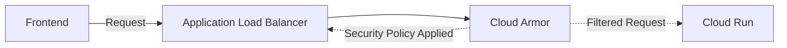

パブリックテクノロジーズでテックリードをしている[yoshiki-0428](https://x.com/yoshiki__0428)です。普段はX (Twitter)で活動等しています。


# はじめに


マルチテナントのサービスを運用していると、「特定の顧客（テナント）だけにアクセスを許可したい」「許可されたIPアドレス以外からのアクセスは制限したい」といったニーズが出てきます。こうしたアクセス制御を適切に行うことで、セキュリティを強化しながら、リリースできるかと思います！


Google Cloudでは、**Application Load Balancer（ALB）** を使ってトラフィックを管理し、**Cloud Armor** でアクセス制御を行うことで、こうしたIP制限を実現できます。


この記事では、Terraformを使って、**GCP ALBとCloud Armorを活用したテナントごとのIP制限の設定方法** を紹介します。具体的なコードを交えながら、シンプルかつスケーラブルな構成を解説していくので、ぜひ参考にしてみてください！


## 概略図


:::message
弊社ではよくCloud Runを使用していますが、GCEでも可能です
:::





## これができると嬉しいこと


Google Cloudでサービスを提供する際、マルチテナント環境においてテナントごとのアクセス制御が必要になることがあります。特に、特定のIPアドレスからのみアクセスを許可することで、セキュリティを強化できます。


**この構成を導入することで、以下のメリットがあります：**

- **テナントごとに異なるIP制限を設定** できる（例：A社は特定IPからのみ、B社は別のIPからのみ許可）
- アプリケーションでの管理が不要で、インフラだけで仕様を吸収できる
- **GCPのApplication Load Balancer（ALB）とCloud Armorを活用** することで、スケーラブルなセキュリティ対策を実現
- **Terraformを使ってインフラのコード管理** が可能になり、設定変更が容易

本記事では、GCPの**ALB（Application Load Balancer）とCloud Armor** を利用し、テナントごとにIP制限を適用する方法を解説します。


## GCP ALBとCloud Armorの基本概念


まず、GCPの**ALB（Application Load Balancer）** と**Cloud Armor** の基本を押さえておきましょう。


### **GCP ALB（Application Load Balancer）とは？**

- Google Cloudの**L7ロードバランサ（HTTP/HTTPS）**
- バックエンドの**複数のサービス** を統合して、リクエストを適切にルーティング
- **URLパスベースのルーティング** も可能


@[card](https://cloud.google.com/load-balancing/docs/application-load-balancer?hl=ja)


### **Cloud Armorとは？**

- GCPの**WAF（Web Application Firewall）**
- **IP制限・DDoS対策** などのセキュリティ機能を提供
- **Security Policy（セキュリティポリシー）** を定義し、ALBを通過するリクエストをフィルタリング


@[card](https://cloud.google.com/security/products/armor?hl=ja)


この2つを組み合わせることで、テナントごとにIP制限を適用できます。


## テナントごとにCloud ArmorでIP制限を設定する方法


テナントごとに異なるIP制限を適用するには、Cloud Armorの**セキュリティポリシー** を動的に設定する必要があります。


### **基本の考え方**

1. **各テナントに対する許可ルール（Allow）を作成**
2. **許可されていないアクセスを拒否（Deny）**
3. **デフォルトルールでその他のアクセスを許可**

### **Terraformのコード解説**


以下のコードを使うことで、テナントごとに異なるIP制限を適用できます。


```hcl
locals {
  tenant_configs = [
    {
      tenant          = "pubtech"
      allowed_ip_expr = "inIpRange(origin.ip, 'yy.yy.yy.yy')"
      allow_priority  = 1000
      deny_priority   = 2000
    },
    {
      tenant          = "hoge-tenant"
      # 複数ある場合
      allowed_ip_expr = "(inIpRange(origin.ip, 'yy.yy.yy.yy' || inIpRange(origin.ip, 'xx.xx.xx.xx')"
      allow_priority  = 1100
      deny_priority   = 2200
    }
  ]
}

resource "google_compute_security_policy" "tenant_ip_policy" {
  name        = "tenant-ip-policy"
  description = "Tenant-specific IP restriction policy"
  project     = var.project_id

  dynamic "rule" {
    for_each = local.tenant_configs
    content {
      action      = "allow"
      priority    = rule.value.allow_priority
      description = "Allow ${rule.value.tenant} requests from allowed IPs"
      match {
        expr {
          expression = "request.path.matches('.*/${rule.value.tenant}/.*') && ${rule.value.allowed_ip_expr}"
        }
      }
    }
  }

  dynamic "rule" {
    for_each = local.tenant_configs
    content {
      action      = "deny(403)"
      priority    = rule.value.deny_priority
      description = "Deny ${rule.value.tenant} requests from non-allowed IPs"
      match {
        expr {
          expression = "request.path.matches('.*/${rule.value.tenant}/.*')"
        }
      }
    }
  }

  rule {
    action      = "allow"
    priority    = 2147483647
    description = "Default rule, allow all other traffic"
    match {
      versioned_expr = "SRC_IPS_V1"
      config {
        src_ip_ranges = ["*"]
      }
    }
  }
}
```


### **ポイント**

- `local.tenant_configs` に**テナント情報とIP制限ルール** を定義
- `google_compute_security_policy` で**Cloud Armorのセキュリティポリシー** を作成
- **テナントごとの許可ルールと拒否ルール** を動的に適用
- `expression`ではCloud Armorのカスタムルールで細かくリクエストを分けることが可能


@[card](https://cloud.google.com/armor/docs/rules-language-reference?hl=ja)


### ALBにCloud Armorのポリシーを適用する


作成したCloud Armorのポリシーを**ALB（Application Load Balancer）** に適用するには、バックエンドサービスにポリシーを関連付けます。


```hcl
resource "google_compute_backend_service" "example_backend" {
  name          = "example-backend"
  project       = var.project_id
  protocol      = "HTTP"
  security_policy = google_compute_security_policy.tenant_ip_policy.self_link
}
```


### **ポイント**

- `google_compute_backend_service` の `security_policy` に、作成した**Cloud Armorのポリシー** を設定
- これにより、ALBを経由するリクエストが**テナントごとのIP制限** に従う

### まとめ


本記事では、GCPの**Application Load Balancer（ALB）** と**Cloud Armor** を活用し、**テナントごとにIP制限を適用** する方法を解説しました。


✅ **テナントごとのIP制限を実現** できる


✅ **Terraformを使って管理** できる


✅ **Cloud Armorを活用することでセキュリティ強化** が可能


この仕組みを導入することで、マルチテナント環境において、効率的柔軟にIP制限をかけることが可能です。URLにテナントIDが含まれていなくても、Headerに`X-Tenant-ID` などで管理すれば同じように利用可能かと思います。

