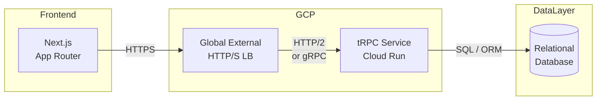

こんにちは、TLをしている[Yoshiki](https://x.com/yoshiki__0428)です。今回はLG-WANという制約の強い環境でファイルアップロードを実装する中で経験した試行錯誤のストーリーと学びをお届けします。エンジニアなら一度は経験するかもしれないファイルアップロードでの「**Yak Shaving**」状態を回避するヒントも含めて紹介します。

:::details **Yak Shaving**とは


「Yak Shaving (ヤクの毛刈り)」とは、**本来の目的を達成するために必要な一連の作業**を指す言葉で、その過程で本来とは直接関係のない、しかし解決しなければならない問題が次々と現れ、本来の目的から大きく逸れてしまう状況を指します。まるで、毛深いヤクの肉を食べるために、まず毛を刈る必要があり、そのために特別な刃物や研ぎ石が必要になるように、本来の目的を達成するために、関係のない様々な問題解決が必要になる状況を指す比喩です。


:::


エンジニアでファイルアップロードを実装しないことってないですよね？ほぼ全員が通る道だと思っています。


## 前提: パブテクのプロダクトについて


私の担当しているプロダクトではAll TypeScriptの開発環境でRPCとしてtRPCを採用しています。


### なぜ[tRPC](https://trpc.io/)を採用したのか？


別のプロダクトではPythonのFastAPIを採用しており、常々開発をしていく中で、OpenAPIとYAMLの変換、API GatewayへのYAMKのデプロイやclient generateライブラリであるorvalでのコード変換の煩わしさに少なからず課題を感じていました。


そのため、このプロダクトではAIと親和性の高いTypeScript, [tRPC](https://trpc.io/)を優先的に採用をしています。


他の方の記事でもご紹介されていますが、tRPCを利用すると型をFEと共有できOpenAPIを作成せずにAPI連携ができる大きいメリットがあります。


@[card](https://zenn.dev/is_ryo/articles/08a9710d9f6ee2)


@[card](https://zenn.dev/praha/articles/encouragement-trpc)


このプロダクトの[tRPC](https://trpc.io/)はGCPのCloud Run上で[Fastify](https://www.fastify.io/)で動かしており、FEはVercel上で稼働をしており、Nextjsを利用しています。





そんな中でハマってしまった落とし穴と対策の軌跡を徒然と書いていきます


# tRPCのmultipart-formの対応状況


本家のissueでは明確にファイル送信の方式には対応されないことが明記されています。


やはりjson全体のRPCが前提であるため、対応がなされないのでしょう。tRPC本体ではどうにもならなそうです。


@[card](https://github.com/trpc/trpc/issues/1401)


## tRPCでファイルアップロードの落とし穴


---


### 1. tRPC で詰む ― LG-WAN × 署名付き URL


LG-WAN は閉域網である。


@[card](https://zenn.dev/govtechtokyo/articles/fccc9dc2d032c2)


まずS3 Presigned URL に飛ばせない。


なので **まずは超シンプルに base64** で投げてみた。


```typescript
// client ‐ ブラウザ側 (tRPC)
const arrayBuf = await file.arrayBuffer();
const base64 = Buffer.from(arrayBuf).toString("base64");

await trpc.uploadFile.mutate({
  fileName: file.name,
  mimeType: file.type,
  data: base64,           // 👈️ ここが重い
});
```


```typescript
// server ‐ tRPC ルーター (Node)
uploadFile: publicProcedure
  .input(
    z.object({
      fileName: z.string(),
      mimeType: z.string(),
      data: z.string(), // base64
    }),
  )
  .mutation(async ({ input }) => {
    const buf = Buffer.from(input.data, "base64");
    await fs.promises.writeFile(`/mnt/uploads/${input.fileName}`, buf);
    return { ok: true };
  });
```


_当然だけど_ 数十 MB のファイルは即メモリ死亡&URLの長さには限界がある → 却下。


ここで Yak Shaving Round 1 終了。


---


### 2. Next.js API ルートで再挑戦 → 4.5 MB の壁


「Nextjs APIならデプロイも不要だしすぐリリースできるじゃん！」と欲を出す。


が、`4.5 MB` の制限がある 🤯


@[card](https://www.reddit.com/r/nextjs/comments/1dfubnk/nextjs_in_vercel_has_45mb_response_size_limit_for/)


```typescript
// pages/api/upload.ts
import formidable from "formidable";

export const config = {
  api: {
    bodyParser: false,
    sizeLimit: "4mb", // ← 4 MB しか許可されない
  },
};

export default async function handler(req, res) {
  const form = formidable({});
  form.parse(req, (err, _fields, files) => {
    if (err) return res.status(500).json({ err });
    // files.file is undefined if bigger than 4 MB
    return res.status(200).json({ ok: true });
  });
}
```


LG-WAN 以前に「顧客の期待値」を満たせないので却下。


Yak Shaving Round 2 🏁


---


### 3. Fastify 直叩き作戦 ― HTTP/1.1 で 30 MB 上限


Fastify 本体は Cloud Run 上で常駐してる。


だったら **multipart をストリーム保存** すりゃ良いじゃん、という流れ。


```typescript
/* src/server.ts */
import fastify from "fastify";
import multipart from "@fastify/multipart";
import fs from "node:fs";
import path from "node:path";
import { pipeline } from "node:stream/promises";

const app = fastify({ logger: true });
await app.register(multipart);

app.post("/upload", async (req, reply) => {
  const file = await req.file(); // fastify type: MultipartFile
  const dest = path.join("/mnt/uploads", file.filename);

  await pipeline(file.file, fs.createWriteStream(dest)); // 🔥 stream!
  return { ok: true };
});

app.listen({ port: 8080 });

```


ストリームなのでメモリ無問題。


**ただし HTTP/1.1 の 30 MB 制限** にブチ当たる → Round 3 終了。


## 4. TUSプロトコルを使い分割での巨大ファイルアップロードを試す


```javascript
const express = require('express');
const { TusServer } = require('@tus/server');
const { FileStore } = require('@tus/server/lib/stores'); // FileStoreを使用する場合

const app = express();
const port = 8000;

// アップロードされたファイルを保存するディレクトリを指定
// このディレクトリはサーバーを実行する前に存在している必要があります
const uploadDirectory = './uploads';

// TusServerのインスタンスを作成
// FileStoreを使用してファイルをディスクに保存します
const tusServer = new TusServer({
  path: '/uploads', // TUSエンドポイントのパス
  datastore: new FileStore({ directory: uploadDirectory }),
});

// TUSハンドラーをExpressアプリにミドルウェアとして追加
app.all('/uploads', tusServer.handle);
app.all('/uploads/*', tusServer.handle);

// ルートエンドポイント（オプション）
app.get('/', (req, res) => {
  res.send('TUS Node.js Server is running!');
});

// サーバーを起動
app.listen(port, () => {
  console.log(`TUS server listening at http://localhost:${port}`);
  console.log(`Upload endpoint: http://localhost:${port}/uploads`);
});

// uploadsディレクトリが存在しない場合は作成
const fs = require('fs');
if (!fs.existsSync(uploadDirectory)) {
  fs.mkdirSync(uploadDirectory);
  console.log(`Created upload directory: ${uploadDirectory}`);
}
```


実装が複雑、clientとserverの両方に専用実装が必要。かつ、TUSが思った以上に流行っていない→ 頑張るメリットが少ない → Round 4 終了。


---


### 5. Cloud Run を **HTTP/2** 化してラスボス突破


Cloud Run は `gcloud` ひと声で HTTP/2 を有効化できる。


```shell
gcloud run services update my-upload-svc --use-http2
```


Fastify も HTTP/2 モードに切替。


```typescript
/* src/server-http2.ts */
import fastify from "fastify";

const app = fastify({
  http2: true,
  // allowHTTP1 true にしておくとブラウザが古くても安全
  https: { allowHTTP1: true },
});

// … (前述の /upload エンドポイントそのまま)

```


90 MB の PDF もスルっと通過。


Yak Shaving Final Round 👑 完。


---


### まとめ ― Yak Shaving を回避するチェックリスト

- [ ] 先に「最終的に必要な最大サイズ」を聞いた？

	→ 要件が確定していなくてもいずれ大きくなるのでサービスの限界値を知っておこう！

- [ ] サーバレスならファイルサイズ上限を確認した？

	→ Lambdaなら4.5MB, CloudRun http1.1なら30MB！

- [ ] 閉域 (LG-WAN) or プロキシ透過性を調査した？

	→ LG-WANを学ぼう！


	
@[card](https://zenn.dev/topics/lgwan)
	

- [ ] HTTP/2 / gRPC / WebSocket など転送プロトコルを見積もった？

	→ もしかしたらhttp2やWebSocketが使えないこともあるかもLG-WAN ASPベンダーに確認しましょう。WebSocketはプロトコルが違うので通信できないこともあるかも。無難にSSEを選んでおくと、スムーズに進むかもしれません。

> 教訓
>
> 「あとで増えるかも」を見越して、
>
>
> **アーキテクチャ選定時に “ネットワーク層の制約” を先に洗う**。
>
>
> それが真の Yak Shaving 防止策。
>
>

---


これで “ファイルアップロード沼” に悩む同志の一助になれば幸いです 🙌


# 最後に


弊社はパブリックテクノロジーズという「公器のためのテクノロジーを社会に浸透させる」目的を持った会社です！LG-WANのような制限の多い環境でもなるべくモダンな技術や最新のテクノロジーを多く駆使して社会インフラを支えるお手伝いをしています。


絶賛エンジニア募集中のため、興味のある方がいれば、TwitterのDMでもHPでもご連絡をお待ちしております！

