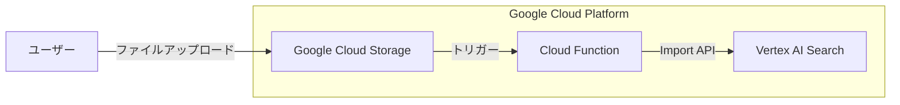

## はじめに


こんにちは！パブテクでテックリードをしているyoshikiです！


今回は、Google Cloudの**Vertex AI Search**を使って、より実践的で本格的なシステム構成を実現する方法について紹介します。単なるデモやPoCではなく、実際の業務システムで使えるような構成を目指しています。


Vertex AI Searchは、Googleの検索技術を活用した強力なエンタープライズ検索サービスですが、実際の業務システムに組み込む際にはいくつかの課題があります。特に今回は以下のポイントに焦点を当てていきます：


1. マルチテナント環境での効率的なエンジン管理
2. 構造化データを活用した検索精度の向上
3. GCSトリガーによる自動インポートの実装

実際に私たちが本番環境で使っている実装をベースに、具体的なコード例も交えながら解説していきます。それでは早速見ていきましょう！


## システム構成図





## マルチテナント環境でのVertex AI Search設計


### 課題：エンジン数の制限


Vertex AI Searchを使う上でぶつかる壁が「エンジン数の制限」です。[Google Cloudのドキュメント](https://cloud.google.com/generative-ai-app-builder/quotas?hl=ja)によると、1プロジェクトあたりのVertex AI Search エンジン作成数は100〜500に制限されています（リージョンによって異なります）。100以上の作成は申請が必要です。


多くのテナントを抱えるSaaSサービスでは、テナントごとにエンジンを作成していると、あっという間にこの制限に達してしまいます。そこで私たちが採用したのは「マルチテナント共有エンジン」という設計にしました。


IAMと連携をすれば、ACLでの制限も可能です。詳細はこちらを参考にしてみてください。


[https://www.softbank.jp/biz/blog/cloud-technology/articles/202409/vertex-ai-search-accesscontrol/](https://www.softbank.jp/biz/blog/cloud-technology/articles/202409/vertex-ai-search-accesscontrol/)


### 解決策：テナントIDによるフィルタリング


```typescript
async getRelevantDocuments(
  query: string,
  relevanceThreshold: "HIGH" | "MEDIUM" | "LOW" = "HIGH",
): Promise<VertexAIDocument[]> {
  try {
    // Google Cloud 認証トークンを取得
    const client = await this.auth.getClient();
    const accessToken = await client.getAccessToken();

    const requestBody = {
      servingConfig: `projects/${this.projectId}/locations/${this.location}/collections/default_collection/engines/${this.engineId}/servingConfigs/default_search`,
      query: query,
      filter: `tenant_id: ANY("${this.tenantId}")`,  // テナントIDでフィルタリング
      pageSize: this.maxDocuments,
      relevanceThreshold,
    };

    // 以下省略...
  }
}
```


このコードでは、検索リクエスト時に `filter: tenant_id: ANY("${this.tenantId}")` というフィルターを指定しています。これにより、[Vertex AI Search のフィルタリング機能](https://cloud.google.com/vertex-ai/docs/search/filter-search-results)を使って、1つのエンジンに複数テナントのデータを格納しながらも、検索結果は特定のテナントのデータだけに絞り込むことができます。


### JSONLでのリンク構造の活用


Vertex AI Searchへのデータ取り込みには、JSONLフォーマットを使用しています。特に重要なのが、ドキュメント間のリンク構造を表現できる点です。


```json
{
  "id": "doc-123456",
  "content": {
    "mimeType": "application/pdf",
    "uri": "gs://tenant-documents/tenant-abc123/meeting-minutes-2025-q1.pdf"
  },
  "struct_data": {
    "tenant_id": "tenant-abc123",
    "department_id": "dept-planning",
    "title": "議事録：2025年第1四半期戦略会議",
    "created_by": "user-xyz789",
    "modified_by": "user-xyz789",
    "document_type": "meeting_minutes",
    "created_at": "2025-05-15T09:30:00Z",
    "tags": "戦略,四半期計画,経営会議",
    "related_documents": "doc-789012,doc-345678",
    "confidentiality": "社内限定"
  }
}

```


このようなJSONL形式でデータを準備することで、ドキュメント間の関連性も含めてインデックス化できます。`related_documents`のような配列フィールドを使って、ドキュメント間のリンク関係を表現できるのが大きなメリットです。


## 構造化データを活用した検索精度の向上


Vertex AI Searchの強みの一つが、構造化データと非構造化データを組み合わせた検索が可能な点です。


通常構築する場合は、GCSのフォルダを指定してVertexAI Search DataStoreを作成できると思いますが、このままだと、テナントごとのフォルダ分けをせずに運用をしていくと他テナントのファイルが閲覧できてしまい、非常に危険です。


### structDataフィールドの活用


```typescript:uriにgs://hoge/hoge.pdf のように記載するとVertexAI側がテキスト化してIndexしてくれます
interface VertexAiJsonlEntry {
  id: string;
  content: {
    mimeType: string;
    uri: string;
  };
  struct_data: {
    tenant_id: string;
    department_id?: string;
    modified_by?: string;
    created_by?: string;
    title?: string;
    [key: string]: string | undefined;
  };
}
```


上記のように、Vertex AI Searchのレスポンスには`structData`というフィールドが含まれています。ここには、ドキュメントのメタデータが格納されており、[公式ドキュメント](https://cloud.google.com/generative-ai-app-builder/docs/provide-schema?hl=ja)にあるように、これらのフィールドは検索対象として自動インデックスされます。


例えば、特定の作成者のドキュメントだけを検索したい場合は：


```typescript
const requestBody = {
  // 省略...
  filter: `tenant_id: ANY("${this.tenantId}") AND created_by: ANY("${userId}")`,
  // 省略...
};
```


このように、構造化データをフィルタリング条件として使用できます。また、検索結果の表示やソートにも活用できるため、UIの使い勝手も向上します。


### 実装のポイント


構造化データを効果的に活用するためのポイントは以下の通りです：

1. **一貫したスキーマ設計**: すべてのドキュメントで同じ構造のメタデータを持たせる
2. **適切なフィールド名**: 検索時のフィルタリングを考慮したフィールド名設計
3. **型の統一**: 同じフィールドには同じ型のデータを格納する

## GCSトリガーによる自動インポートの実装


最後に、ドキュメントの自動インポートの仕組みについて紹介します。私たちは、Google Cloud Storageにファイルがアップロードされたタイミングで、自動的にVertex AI Searchにインポートする仕組みを構築しています。


VertexAIのimport処理はどちらにせよ非同期になるため、metajsonが保存されたときをトリガーに実行されるようにしています。（ここらへん標準対応して欲しいなぁ）


### Cloud Functionsの実装


```typescript
/**
 * Cloud Function that triggers on finalized GCS objects
 * and imports data to Vertex AI
 */
export const handler = async (gcsObject: GCSObject) => {
    // GCSファイル情報を取得
    const { bucket, name } = gcsObject;

    // meta_jsonディレクトリのファイルのみ処理
    if (!name?.startsWith("meta_json/")) {
      console.log(
        `Skipping file ${name} as it's not in meta_json/ directory`,
      );
      return;
    }

    console.log(`Processing file: gs://${bucket}/${name}`);

    try {
      // GCSオブジェクトIDをリクエストIDとして使用（べき等性のため）
      await runImport(`gs://${bucket}/${name}`, gcsObject.id);
      console.log("Import completed successfully");
    } catch (error) {
      console.error("Error during import:", error);
      throw error; // 再スローしてCloud Functionを失敗とマーク
    }
};

```


このCloud Functionは、GCSバケットに新しいファイルがアップロードされたときにトリガーされます。特に`meta_json/`ディレクトリにJSONLファイルがアップロードされた場合に、Vertex AI SearchのインポートAPIを呼び出します。


### インポート処理の実装


```typescript
export async function runImport(manifestUri: string, requestId: string) {
  try {
    console.log(`Starting import from ${manifestUri} with requestId: ${requestId}`);

    // 親リソース名を構築
    const parent = client.projectLocationCollectionDataStoreBranchPath(
      PROJECT_ID as string,
      "global",
      COLLECTION_ID as string,
      DATASTORE_ID as string,
      BRANCH_ID as string
    );

    // インポートリクエストを作成
    const [operation] = await client.importDocuments({
      parent,
      gcsSource: {
        inputUris: [manifestUri],
        dataSchema: "document",
      },
      reconciliationMode: "INCREMENTAL",
    });

    console.log(`Import operation started: ${operation.name}`);

    // Cloud Functionsでは通常タイムアウトするため、待たずに終了
    // const [response] = await operation.promise();

    return { operationName: operation.name };
  } catch (error) {
    console.error("Error in runImport:", error);
    throw error;
  }
}

```


インポート処理では、Discovery EngineのAPIを使用してGCSのJSONLファイルをインポートしています。注目すべき点は以下の通りです：

1. **べき等性の確保**: GCSオブジェクトIDをリクエストIDとして使用し、同じファイルが複数回処理されないようにしています
2. **非同期処理**: インポート処理は時間がかかるため、完了を待たずにCloud Functionを終了させています
3. **増分更新**: `reconciliationMode: "INCREMENTAL"`を指定することで、既存データを保持しながら新しいデータだけを追加・更新できます

## 実装時の注意点


Vertex AI Searchを本格的なシステムで活用する際の注意点をいくつか紹介します：


### 1. エンジン数の管理


前述の通り、エンジン数には制限があります。テナント数が多い場合は、以下の戦略を検討してください：

- 複数のテナントで1つのエンジンを共有
- 複数のGCPプロジェクトに分散
- 使用頻度の低いテナントのエンジンを定期的に削除・再作成

### 2. コスト管理


[Vertex AI Search の料金体系](https://cloud.google.com/vertex-ai/pricing#search)は使用量に応じた課金体系です。特に以下の点に注意が必要です：

- インデックスサイズ（ドキュメント数×サイズ）
- クエリ数
- 高度な機能（意味検索など）の使用

定期的にコストをモニタリングし、必要に応じて最適化を行いましょう。


## まとめ


今回は、Vertex AI Searchをより本格的なシステムで活用するための実装方法について紹介しました。

- マルチテナント環境でのエンジン共有
- 構造化データを活用した検索精度の向上
- GCSトリガーによる自動インポート

これらの実装パターンを活用することで、Vertex AI Searchの制限を克服しながら、本格的な業務システムに組み込むことができます。


実際の実装では、システムの要件や規模に応じてさらなるカスタマイズが必要になるかもしれませんが、今回紹介した方法が参考になれば幸いです。

